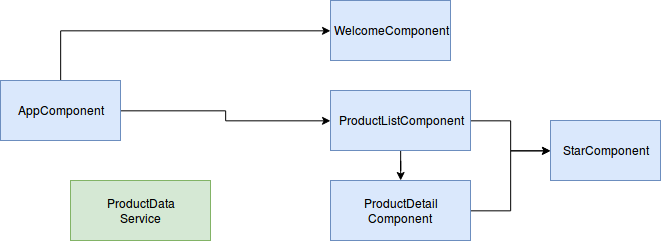

# Introduction

* Une Application est composée :
    * Component
    * Component
    * Component

* Un Component est composé :
    * Template HTML
    * Classe (propriètés & méthodes)
    * MetaData (```@Component```, informations supplémentaire)

Dans chaque application Angular, il y a un composant racine (```Root Angular Component```) qui s'appelle souvent ```AppComponent``` par convention de nommage. Il existe une hiérarchie et des dépendances entre les composants.



# First Things

Il est possible de coder en Angular avec : ES5, ES2015, TypeScript. Il est conseillé d'utiliser TypeScript, il nécessite cependant un transpiler (compilateur source à source) pour générer du Javascript compréhensible par un navigateur.

Pour manipuler TypeScript : http://www.typescriptlang.org/Playground

* Environnement : 
    * npm (Node Package Manager pour les modules Javascript), doit être installé.
    * angular (avec angular-cli), doit être installé.

Si durant ```npm install```, il y a une erreur due au certificat SSL : ```npm config set strict-ssl false```

* package.json : contient une partie script permettant de lancer les tests, compiler, ect... ng = angular-cli

* ```@Component``` est un décorateur = fonction avec en paramètre un objet JSON. 

* Coding Rule sur les noms des fichiers : name.type.ts avec type pouvant être module, service, component.

* Angular = SPA = Single Page Application (index.html). Il s'agit d'une application web avec une unique page qui peut charger différents composants.

# BootstrapComponent

Lien entre les modules et les composants.

Extrait du app.module.ts
```
@NgModule({
    imports:
    declarations: [AppComponent]  # Declaration, car l'AppComponent appartient à l'AppModule
    bootstrap: [AppComponent]  # Composant de lancement de l'application
})
```

# Template/Interpolation/Directives
* Debug dans Chrome : F12
* Framework GUI du tutorial : Bootstrap, fontawesome (pour la partie notation avec des étoiles)
* Directives : custom HTML element or attributes used to power up and extend our HTML
* Structural Directives :
    * ```*ngIf='products && products.length'```: condition d'affichage
    * ```*ngFor='let product of products'``` : boucle d'affichage

* For in & for of en Javascript :
    * for of : permet d'itérer sur un tableau d'objets
    * for in : permet d'itérer sur les propriètés d'un objet

* Data binding : 
    * Interpolation : one way data binding dans le template : ```{{ pageTitle }}``` avec ```pageTitle``` qui est une proprièté de la classe.
    * Property binding, ```src``` est la propriète de l'élément HTML : `````` ou en interpolation ``````