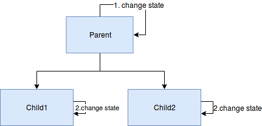
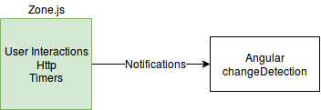

# Introduction

Historiquement, on parlait de AngularJs (version 1.x), désormais ce framework s'appelle Angular (version supérieure à 2.x).

Exemple de structure d'un projet Angular :
* e2e : Tests
* node_modules : tous les modules NPM
* src : code source de l'application
* fichiers de configuration de l'application

Angular sort une version majeure tous les 6 mois. Pour les versions LTS, le support est de 1 an.

# Avantages d'Angular :
* Progressive Web App : utilisable en application mobile avec une icône dédiée, peut-être hors ligne
* Lazy loading : optimisation du chargement des pages web
* Formulaires
* RxJs : traitement des données de façon asynchrone
* Animations et transition entre les pages

# Angular Architecture 
* One way Data Flow : Détection des changements qui permet d'optimiser le redessin. Il y a une notion d'héritage qui propage les changements d'états des composants parents.



* Dependency Injection
```
export class Titi {
    constructor(private name : Type){}  ## Dependency Injection
}
```
La classe ```Titi``` nécessite la création d'une classe ```Type``` pour fonctionner.

* Components : est en charge d'afficher des données. Il est associé à un tag HTML dans la définition du composant (```@Component selector```).
* Directives : fonctions dans le HTML qui permettent d'avoir des fonctionnalités en plus (communication/interactivité entre le HTML et le composant).
* Templates : contient les données HTML de la vue. Associé à un composant via le tag ```@Component template``` (inline template) ou ```templateUrl``` pour les fichiers de template à part. En plus du HTML classique, il contient des directives.
* Zone.js : module intégré à Angular qui permet une meilleure détection des changements, et donc une optimisation du redessin.



Ce module est très important pour l'aspect performance

# Tooling
* Angular CLI : 
    * créer des applications, composants, services, pipe
    * web server pour le test
    * linting (coding rules)
    * tests
    * compilation

* Server side rendering : Angular Universal
* Native mobile application : Ionic, Native Script
* Desktop application : Electron
* Outils de tests :
    * Karma : pour le test unitaire
    * Protractor : automatisation de tests dans un navigateur (utilise selenium)
    * Angular Testing Tools : TestBed, Async&Fake Async, Mock Backend